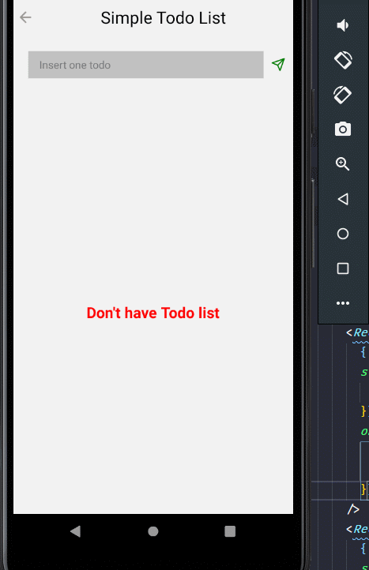
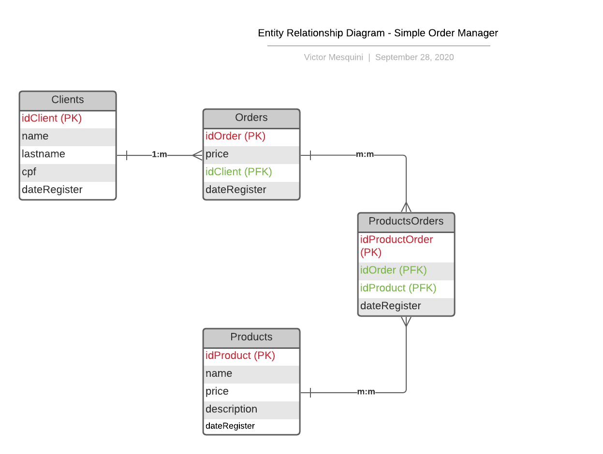

<h1 aling="center"> Challenge Kaffa  </h1>
 

  <a href="#rocket-technology">Technology</a>&nbsp;&nbsp;&nbsp;|&nbsp;&nbsp;&nbsp;
  <a href="#pre-requisites">Pre-requisites</a>&nbsp;&nbsp;&nbsp;|&nbsp;&nbsp;&nbsp;
  <a href="#information_source-installation-and-execution">Installation and execution</a>&nbsp;&nbsp;&nbsp;|&nbsp;&nbsp;&nbsp;
  <a href="#clapper-preview-mobile">Preview Mobile</a>&nbsp;&nbsp;&nbsp;|&nbsp;&nbsp;&nbsp;
  <a href="#clapper-preview-web">Preview Web</a>&nbsp;&nbsp;&nbsp;|&nbsp;&nbsp;&nbsp;

## :rocket: Technology

- 💾 Async-Storage — Is an unencrypted, asynchronous, persistent, key-value storage system that is global to the app. It should be used instead of LocalStorage.
- 💅 Styled-Components - Visual primitives for the component age. Use the best bits of ES6 and CSS to style your apps without stress.
- 📐 Size-Matters - A React-Native utility belt for scaling the size of your apps UI across different sized devices.
- 🔎 Vector-Icons - Perfect for buttons, logos and nav/tab bars. Easy to extend, style and integrate into your project.

## Pre-requisites

- [Node.js](https://nodejs.org/en/)
- [Yarn](https://yarnpkg.com/pt-BR/docs/install)
- [VS Code][vc]

## :information_source: Installation and execution

To clone the repository, you will need the [Git](https://git-scm.com), [Node.js v10.16][nodejs] + [Yarn v1.13][yarn]

1. Clone this repository;
2. Enter the `cd mobile` folder;
3. Run `yarn` to install the dependencies;
4. Run `yarn android` in the mobile folder to start the App.

## :clapper: Preview Mobile

## :clapper: Preview Web

### 8) Entity Relationship Diagram - Simple Order Manager

Made with ♥ by Victor Mesquini :wave: [Get in touch!](https://www.linkedin.com/in/mesquini/)

[nodejs]: https://nodejs.org/
[yarn]: https://yarnpkg.com/
[vc]: https://code.visualstudio.com/
